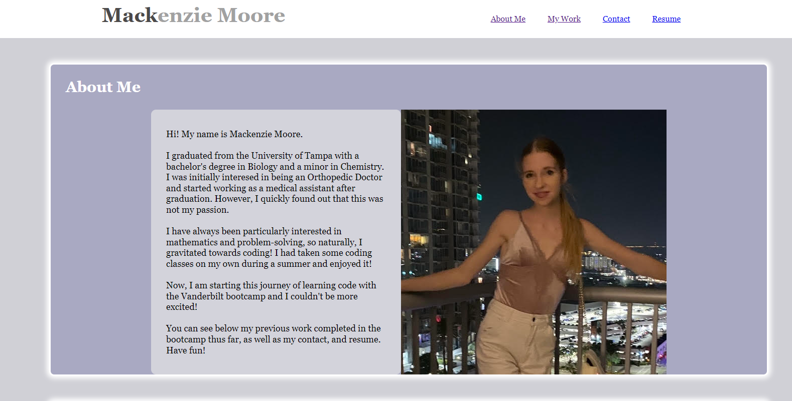
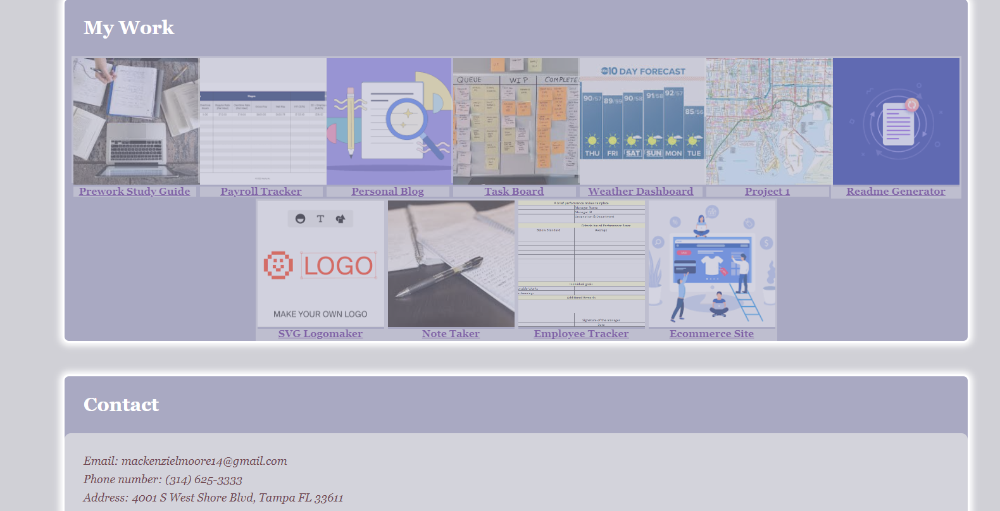

# 2-creating-portfolio

## Description

The second challenge assignment from a bootcamp where the task was to create a web application from scratch. The web application created is my portfolio.

## Table of Content
  -[Description](#Description)
  -[Process](#Process)
  -[Links](#Links)
  -[Installation](#Installation)
  -[Usage](#Usage)
  -[Licenses](#Licenses)
  -[Contribution](#Contribution)
  -[Acknowledgement](#Acknowledgement)
  -[Questions](#Questions)

## Process

The process included adding four sections of content, 'About Me', 'My Work', 'Contact', and 'Resume'. Each section is linked in the header of the webpage. The header features the name of the developer as well. The 'About Me' section includes a photo of the developer. The 'My Work' section includes all the projects the developer worked on. When you hover over a topic, the opacity increases ('lighting up the topic'). Various advanced CSS styling tools were used, including but not limited to, variables, flexbox, positions, hover links, box shadow, border-radius, and media queries. The 'Contact' section inclues the develoepr's email, phone number, and address. The 'Resume' section includes links to developer's resume and Github account.

## Links

Link to website used for this challenge.
https://mackemo.github.io/2-creating-portfolio/

Link to public Github repository for this challenge.
https://github.com/mackemo/2-creating-portfolio

## Installation

To install this application, copy the ssh key from my github repo and clone it into your respository.

## Usage

This site was a practice assignment for bootcamp students but can be used to see how a simple website can be created by inspecting the webpage.

## License

N/A

## Contribution
  
Contact me by email provided in Questions section

## Acknowledgement

Project was done by the knowledge learned from bootcamp instructor John.

## Questions
  
Contact with questions at:
  
Email: mackenzielmoore14@gmail.com
Click [here](https://github.com/mackemo) for Github account.
