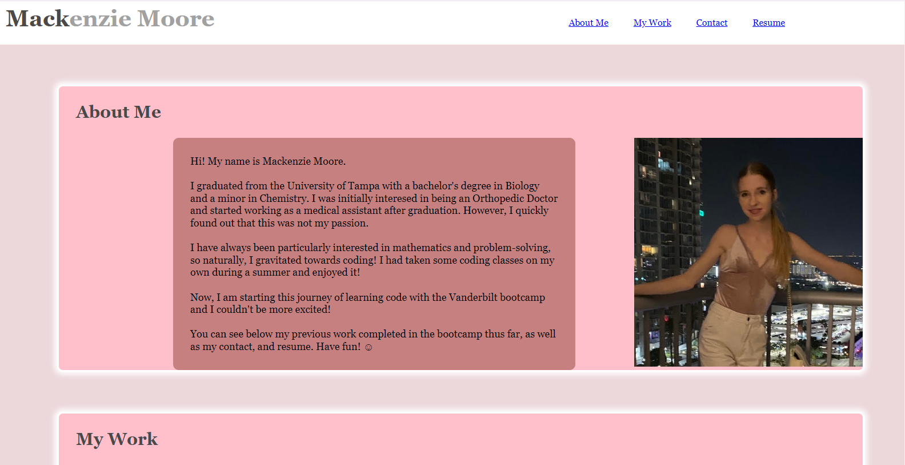
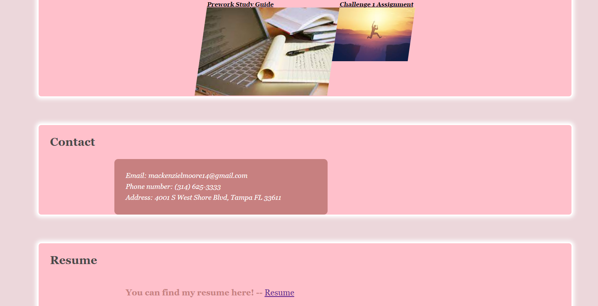

# 2-creating-portfolio

## Description

The second challenge assignment from a bootcamp where the task was to create a web application from scratch. The web application created is my portfolio.

## Process

The process included adding four sections of content, an 'About Me', 'My Work', 'Contact', and 'Resume'. Each were linked in the header that included my name. In the 'About Me' section, I added a photo of myself. In the 'My Work' section, two projects are linked into photos with my first project having a larger photo. Various advanced CSS styling tools were used, including but not limited to, variables, flexbox, positions, hover links, box shadow, border-radius, and media queries.

## Links

Link to website used for this challenge.
https://mackemo.github.io/challenge-2/

Link to public Github repository for this challenge.
https://github.com/mackemo/challenge-2

## Installation

N/A

## Usage

This site was a practice assignment for bootcamp students but can be used to see how a simple website can be created by inspecting the webpage.

## Credits

N/A

## License

N/A

## Acknowledgement

Project was done by the knowledge learned from bootcamp instructor John.
